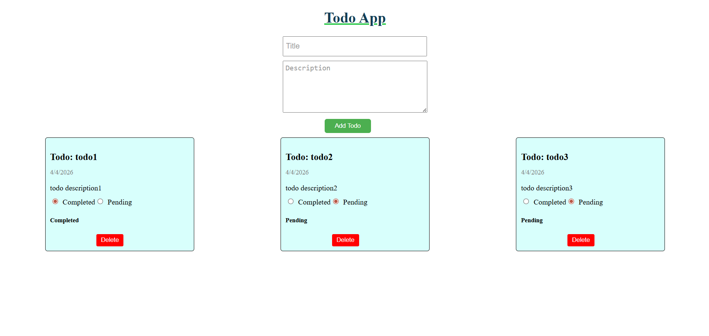

---

#  Todo App

```md
# Todo App

A simple and efficient Todo App built using React and TypeScript to manage daily tasks.

## Live Demo
https://todo-app-localstore.netlify.app/

## Features
- Add new tasks
- Delete tasks
- Mark tasks as completed
- Data stored in local storage

## 🛠️ Tech Stack
- React With Typescript
- Vite
- CSS

## 📸 Screenshot


## 📦 Installation

```bash
git clone git@github.com:asifamin502/Todo-app.git
cd todo-app
npm install
npm run dev
